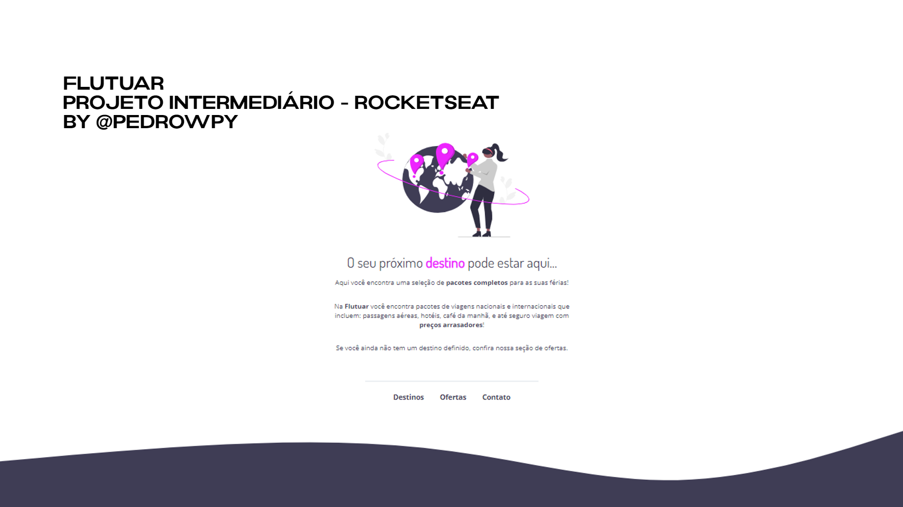

<h1 align="center"> Flutuar </h1>

Evento exclusivo do Explorer, promovido pela Rocketseat para ensino de tecnologias WEB.

  <a href="#-tecnologias">Tecnologias</a>&nbsp;&nbsp;&nbsp;|&nbsp;&nbsp;&nbsp;
  <a href="#-projeto">Projeto</a>&nbsp;&nbsp;&nbsp;|&nbsp;&nbsp;&nbsp;
  <a href="#-layout">Layout</a>&nbsp;&nbsp;&nbsp;|&nbsp;&nbsp;&nbsp;
  <a href="#memo-licença">Licença</a>

  

 

  

## 🚀 Tecnologias

Esse projeto foi desenvolvido com as seguintes tecnologias:

- HTML e CSS
- Git e Github
- Figma

## 💻 Projeto

O Flutuar é um projeto para estudo e desenvolvimento de habilidades técnicas.

## 🔖 Layout

Você pode visualizar o layout do projeto através [DESSE LINK](<https://www.figma.com/design/yTUQnP6yJR5h78h6YM22YC/Projeto01-Extra-(Copy)?node-id=1-2&node-type=frame&t=Gv3jjXh0d4ck33VJ-0>). É necessário ter conta no [Figma](https://figma.com) para acessá-lo.

## :memo: Licença

Esse projeto está sob a licença MIT.

---

Feito por @pedrowpy no Explorer da Rocketseat :wave: [Participe da nossa comunidade!](https://www.discord.com/rockeseat)
